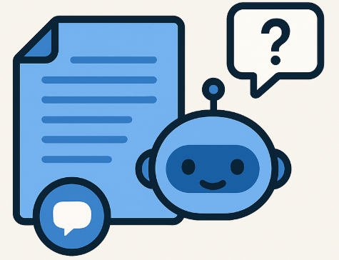

# Azure RAG Docs Assistant

RAG-based AI web API for business document analysis on Azure. It ingests documents, extracts text with Azure Document Intelligence (Form Recognizer), generates embeddings with Azure OpenAI, stores vectors in Azure Cognitive Search, and answers questions by retrieving relevant passages and prompting a GPT model.

- Tech: ASP.NET Core Minimal API, Azure Key Vault, Blob Storage, Application Insights, Cognitive Search (vector search), Document Intelligence, Azure OpenAI (Embeddings + GPT).
- Storage and secrets: All sensitive values are pulled from Azure Key Vault via DefaultAzureCredential.



## Table of Contents
- Features
- Architecture
- Prerequisites
- Configuration
- Run locally
- API Reference
- Azure setup checklist
- Telemetry
- Limitations / Notes
- License

## Features
- File upload to Azure Blob Storage (PDF, PNG).
- Document text extraction using Form Recognizer (prebuilt-document model).
- Text chunking and embedding generation (Azure OpenAI).
- Vector KNN search over documents in Azure Cognitive Search.
- GPT-based Q&A grounded in retrieved document excerpts.
- Application Insights instrumentation (requests, events, exceptions).
- Secrets managed in Azure Key Vault.

## Architecture
1) Upload: Client sends a document (multipart/form-data) to the API; the file is persisted to Blob Storage.
2) Process: The API extracts text with Form Recognizer, chunks it, generates embeddings, and indexes the chunks into Azure Cognitive Search as documents with an embedding vector field.
3) Ask: The API embeds the user’s question, performs vector KNN search against the index to get the most relevant chunks, and prompts the chat model to answer using only those excerpts.

Key components (namespaces):
- Endpoints:
  - UploadBlob (/upload)
  - ProcessDocument (/process)
  - Ask (/ask)
  - SendToAppFunctions (/sendToFunction)
  - HealthCheck (/health)
- Services:
  - Key Vault (ISecretProvider via DefaultAzureCredential)
  - Blob Storage (IBlobStorageService)
  - Document Intelligence (FormRecognizerService)
  - Azure OpenAI Embeddings (TextEmbeddingService)
  - Azure OpenAI Chat (IChatService implemented by GPT_4_Model)
  - Azure Cognitive Search (via SearchClient, index: documents-index)

## Prerequisites
- .NET SDK 7+ (recommended .NET 8).
- Azure subscription with:
  - Azure Key Vault
  - Azure Storage Account (Blob)
  - Azure AI Document Intelligence (Form Recognizer)
  - Azure AI Search (Cognitive Search) with vector search enabled
  - Azure OpenAI resource with deployments for:
    - an Embeddings model
    - a Chat model (e.g., GPT-4)
  - (Optional) Application Insights
- Local Azure login for Key Vault access (e.g., via `az login`) or a managed identity in hosting.

## Configuration

Environment variables:
- KEYVAULT_URI (required): URI of your Key Vault, e.g. https://your-kv.vault.azure.net/
- APPLICATIONINSIGHTS_CONNECTION_STRING (optional): to enable telemetry export.

Key Vault secrets used by the API (as referenced in code):
- Azure Cognitive Search:
  - Azure--search-endpoint: e.g. https://your-search.search.windows.net
  - Azure--search-key: admin/query key for the service
- Document Intelligence:
  - Azure--Form-Recognizer-Endpoint: e.g. https://your-fr.cognitiveservices.azure.com
  - Azure--Form-Recognizer-Key: the API key

Additional secrets required by other services (check their implementations for exact names):
- Azure OpenAI (endpoint, key, and deployment names for embeddings and chat)
- Blob Storage (connection information or credentials used by IBlobStorageService)

Authentication to Key Vault:
- The app uses DefaultAzureCredential. Locally, ensure you are logged in (`az login`) or have a suitable developer identity configured. In Azure, assign a managed identity with Key Vault Secret Get permissions.

## Run locally

1) Set environment variables:
```bash
# Key Vault
export KEYVAULT_URI="https://your-kv.vault.azure.net/"

# (Optional) App Insights
export APPLICATIONINSIGHTS_CONNECTION_STRING="InstrumentationKey=...;IngestionEndpoint=..."
```

2) Ensure required secrets exist in Key Vault:
- Azure--search-endpoint
- Azure--search-key
- Azure--Form-Recognizer-Endpoint
- Azure--Form-Recognizer-Key
- Plus required OpenAI and Blob Storage secrets used by your service classes.

3) Build and run:
```bash
dotnet build
dotnet run --project AiKnowledgeAssistant
```

4) Swagger UI (Development only): http://localhost:5000/swagger or http://localhost:5135/swagger (depending on your ASP.NET ports).

## API Reference

### GET /health
- Returns 200 OK to indicate the API is up.

Example:
```bash
curl http://localhost:5135/health
```

### POST /upload
- Uploads a file to Blob Storage.
- Content type: multipart/form-data
- Allowed file types: application/pdf, image/png

Example:
```bash
curl -X POST "http://localhost:5135/upload" \
  -F "file=@/path/to/document.pdf"
```

Returns:
- 200 OK: "File uploaded successfully"
- 400 Bad Request: when no form or file provided

### POST /process
- Uploads a file, extracts text (Form Recognizer), chunks and embeds it, and indexes chunks into Cognitive Search.
- Content type: multipart/form-data

Example:
```bash
curl -X POST "http://localhost:5135/process" \
  -F "file=@/path/to/document.pdf"
```

Response (200 OK):
```json
{
  "File": "document.pdf",
  "TextPreview": "First 200 characters...",
  "Length": 12345
}
```

Requirements:
- Cognitive Search index named documents-index with a vector field embedding matching your embedding dimensions.

### POST /ask
- Sends a plain text question, performs vector search over indexed chunks, and answers using a GPT chat model constrained to the retrieved context.
- Content type: text/plain (body is the raw question string)

Example:
```bash
curl -X POST "http://localhost:5135/ask" \
  -H "Content-Type: text/plain" \
  --data "What are the payment terms in our contracts?"
```

Response (200 OK):
```json
{
  "question": "What are the payment terms in our contracts?",
  "answer": "..."
}
```

### POST /sendToFunction
- Sends the uploaded file to Azure Functions for additional processing (copy + extract metadata).
- Content type: multipart/form-data
- Requires IApplicationFunctionService to be configured with your Functions endpoints.

Example:
```bash
curl -X POST "http://localhost:5135/sendToFunction" \
  -F "file=@/path/to/document.pdf"
```

## Azure setup checklist

1) Key Vault
- Create a Key Vault and grant your identity Secret Get permissions.
- Add the required secrets (search, form recognizer, and those used by OpenAI/Blob services).

2) Azure Cognitive Search
- Create the service and an index named documents-index.
- Include fields similar to:
  - id (Edm.String, key)
  - content (Edm.String, searchable, filterable=false, sortable=false)
  - embedding (collection of single/float numbers) with a vector profile configured to match your embedding model’s dimensionality and algorithm.
- Enable vector search on the service and on the embedding field.

3) Document Intelligence (Form Recognizer)
- Create a resource and retrieve endpoint and key.
- Use prebuilt-document model ID (already set in the code).

4) Azure OpenAI
- Create deployments for:
  - an Embeddings model (used by TextEmbeddingService)
  - a Chat model (e.g., GPT-4) used by IChatService (GPT_4_Model)
- Store endpoint, key, and deployment names in Key Vault under the names expected by your service classes.

5) Storage
- Create a Storage Account and container(s).
- Store connection details in Key Vault as expected by BlobStorageService.

## Telemetry
- Set APPLICATIONINSIGHTS_CONNECTION_STRING to send logs/metrics/exceptions to Application Insights.
- The app tracks events and request timings for key operations (uploads, processing, Q&A).

## Limitations / Notes
- The API expects an existing Cognitive Search index (documents-index) with a compatible vector field.
- Allowed upload types are restricted to PDF and PNG by default.
- All secrets are resolved at runtime from Key Vault; ensure identities and RBAC are correctly configured.
- Embedding dimensionality must match your index configuration.
- Swagger UI is enabled only in the Development environment.

## License
This project is provided as-is. See repository license file if present.
