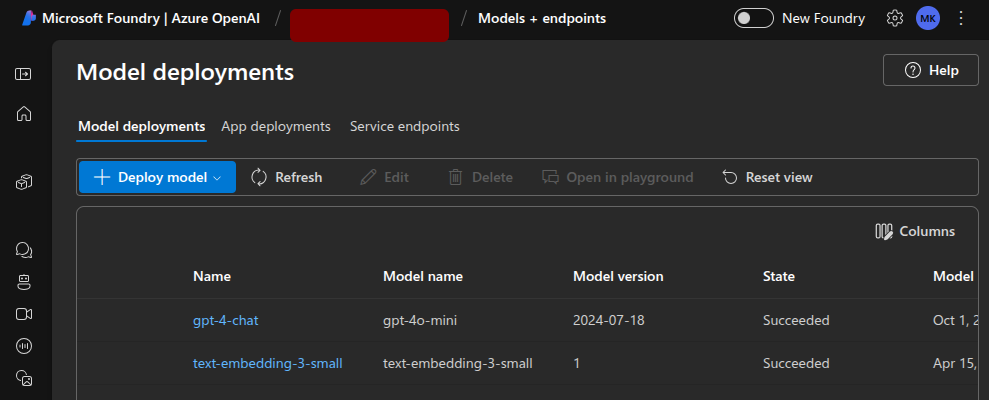
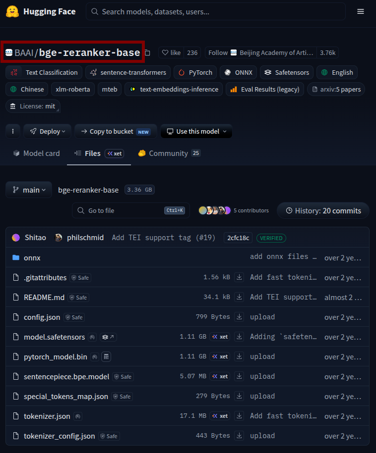
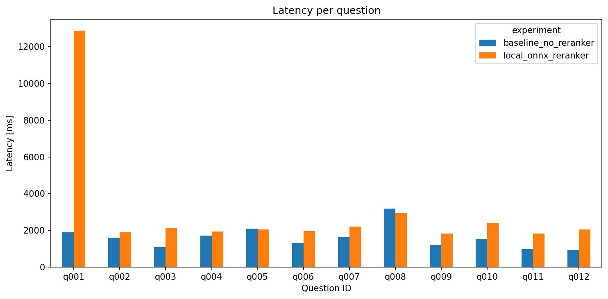

# Azure RAG Docs Assistant

RAG-based AI web API for business document analysis on Azure. It ingests documents, extracts text with Azure Document Intelligence (Form Recognizer), generates embeddings with Azure OpenAI, stores vectors in Azure Azure AI Search, and answers questions by retrieving relevant passages and prompting a GPT model.

- Tech: ASP.NET Core Minimal API, Azure Key Vault, Blob Storage, Application Insights, Azure AI Search (vector search), Document Intelligence, Azure OpenAI (Embeddings + GPT).
- Storage and secrets: All sensitive values are pulled from Azure Key Vault via DefaultAzureCredential.

> [!IMPORTANT]
> This project uses paid Azure resources such as Azure AI Search, Azure OpenAI, Storage, Key Vault, and Document Intelligence.  
> For local development, the recommended workflow is: `terraform apply → test → delete the resource group`.

## Table of Contents
- [Features](#features)
- [Architecture](#architecture)
- [Prerequisites](#prerequisites)
- [Configuration](#configuration)
- [Run locally](#run-locally)
- [API Reference](#api-reference)
- [Azure setup checklist](#azure-setup-checklist)
- [Telemetry](#telemetry)
- [Limitations / Notes](#limitations--notes)

## Features
- File upload to Azure Blob Storage (`.md`, `.txt`, PDF, images).
- Document text extraction using Form Recognizer (prebuilt-document model).
- Text chunking and embedding generation (Azure OpenAI).
- Vector KNN search over documents in Azure Azure AI Search.
- GPT-based Q&A grounded in retrieved document excerpts.
- Application Insights instrumentation (requests, events, exceptions).
- Secrets managed in Azure Key Vault.

## Architecture
1) Upload: Client sends a document (multipart/form-data) to the API; the file is persisted to Blob Storage.
2) Process: The API extracts text with Form Recognizer, chunks it, generates embeddings, and indexes the chunks into Azure Azure AI Search as documents with an embedding vector field.
3) Ask: The API embeds the user’s question, performs vector KNN search against the index to get the most relevant chunks, and prompts the chat model to answer using only those excerpts.

Key components (namespaces):
- Endpoints:
  - UploadBlob (/upload)
  - ProcessDocument (/process)
  - Ask (/ask)
  - SendToAppFunctions (/sendToFunction)
  - HealthCheck (/health)
- Services:
  - Key Vault (ISecretProvider via DefaultAzureCredential)
  - Blob Storage (IBlobStorageService)
  - Document Intelligence (FormRecognizerService)
  - Azure OpenAI Embeddings (TextEmbeddingService)
  - Azure OpenAI Chat (IChatService implemented by GPT_4_Model)
  - Azure Azure AI Search (via SearchClient, index: documents-index)

## Prerequisites
- .NET SDK 7+ (recommended .NET 8).
- Azure subscription with:
  - Azure Key Vault
  - Azure Storage Account (Blob)
  - Azure AI Document Intelligence (Form Recognizer)
  - Azure AI Search (Azure AI Search) with vector search enabled
  - Azure OpenAI resource with deployments for:
    - an Embeddings model
    - a Chat model (e.g., GPT-4)
  - (Optional) Application Insights
- Local Azure login for Key Vault access (e.g., via `az login`) or a managed identity in hosting.

> [!NOTE]
> The app uses `DefaultAzureCredential` to access Azure Key Vault.  
> Locally, run `az login` and make sure the correct subscription is selected before starting the API.

## Configuration

Environment variables:
- KEYVAULT_URI (required): URI of your Key Vault, e.g. https://your-kv.vault.azure.net/
- APPLICATIONINSIGHTS_CONNECTION_STRING (optional): to enable telemetry export.

Key Vault secrets used by the API (as referenced in code):
- Azure Azure AI Search:
  - Azure--search-endpoint: e.g. https://your-search.search.windows.net
  - Azure--search-key: admin/query key for the service
- Document Intelligence:
  - Azure--Form-Recognizer-Endpoint: e.g. https://your-fr.cognitiveservices.azure.com
  - Azure--Form-Recognizer-Key: the API key

> [!WARNING]
> Do not commit `.tfstate`, `.tfvars`, Azure keys, connection strings, or downloaded model files.  
> Secrets should be stored in Azure Key Vault or local user-secrets only.

Additional secrets required by other services (check their implementations for exact names):
- Azure OpenAI (endpoint, key, and deployment names for embeddings and chat)
- Blob Storage (connection information or credentials used by IBlobStorageService)

Authentication to Key Vault:
- The app uses DefaultAzureCredential. Locally, ensure you are logged in (`az login`) or have a suitable developer identity configured. In Azure, assign a managed identity with Key Vault Secret Get permissions.

## Models
---
> [!WARNING]
> Hugging Face / ONNX model artifacts are not committed to the repository.  
> Download them locally using the provided model download script.

---
### Azure OpenAI deployments (models)


### HuggingFace model


## Run locally

1) Set environment variables:
```bash
# Key Vault
export KEYVAULT_URI="https://your-kv.vault.azure.net/"

# (Optional) App Insights
export APPLICATIONINSIGHTS_CONNECTION_STRING="InstrumentationKey=...;IngestionEndpoint=..."
```

2) Ensure required secrets exist in Key Vault:
- Azure--search-endpoint
- Azure--search-key
- Azure--Form-Recognizer-Endpoint
- Azure--Form-Recognizer-Key
- Plus required OpenAI and Blob Storage secrets used by your service classes.

3) Build and run:
```bash
dotnet build
dotnet run --project AiKnowledgeAssistant
```

4) Swagger UI (Development only): http://localhost:5000/swagger or http://localhost:5135/swagger (depending on your ASP.NET ports).

## API Reference

### GET /health
- Returns 200 OK to indicate the API is up.

Example:
```bash
curl http://localhost:5135/health
```

### POST /upload
- Uploads a file to Blob Storage.
- Content type: multipart/form-data
- Allowed file types: application/pdf, image/png

Example:
```bash
curl -X POST "http://localhost:5135/upload" \
  -F "file=@/path/to/document.pdf"
```

Returns:
- 200 OK: "File uploaded successfully"
- 400 Bad Request: when no form or file provided

### POST /process
- Uploads a file, extracts text (Form Recognizer), chunks and embeds it, and indexes chunks into Azure AI Search.
- Content type: multipart/form-data

> [!NOTE]
> Markdown and plain text files are read directly by the API.  
> Binary document formats such as PDF or images are processed through Azure Document Intelligence.

Example:
```bash
curl -k -X POST "http://localhost:5292/process" \
  -F "formFile=@evals/sample-docs/benchmark_document.md"
```

Response (200 OK):
```json
{
  "File": "document.pdf",
  "TextPreview": "First 200 characters...",
  "Length": 12345
}
```

Requirements:
- Azure AI Search index named documents-index with a vector field embedding matching your embedding dimensions.

### POST /ask
- Sends a JSON question, retrieves relevant chunks from Azure AI Search, optionally reranks them, and answers using the configured Azure OpenAI chat deployment.

Example:
```bash
curl -k -X POST "http://localhost:5292/ask" \
  -H "Content-Type: application/json" \
  -d '{"question":"What is the maximum upload file size?"}'
```

Response (200 OK):
```json
{
  "question": "What is the maximum upload file size?",
  "answer": "The maximum upload file size is **30 MB**."
}
```

### POST /sendToFunction
- Sends the uploaded file to Azure Functions for additional processing (copy + extract metadata).
- Content type: multipart/form-data
- Requires IApplicationFunctionService to be configured with your Functions endpoints.

Example:
```bash
curl -X POST "http://localhost:5135/sendToFunction" \
  -F "file=@/path/to/document.pdf"
```

## Azure setup checklist

> [!IMPORTANT]
> Not every Azure service is available in every region.  
> In this setup, most resources can run in `polandcentral`, while Document Intelligence may need a different region such as `swedencentral`.

1) Key Vault
- Create a Key Vault and grant your identity Secret Get permissions.
- Add the required secrets (search, form recognizer, and those used by OpenAI/Blob services).

2) Azure Azure AI Search
- Create the service and an index named documents-index.
- Include fields similar to:
  - id (Edm.String, key)
  - content (Edm.String, searchable, filterable=false, sortable=false)
  - embedding (collection of single/float numbers) with a vector profile configured to match your embedding model’s dimensionality and algorithm.
- Enable vector search on the service and on the embedding field.

3) Document Intelligence (Form Recognizer)
- Create a resource and retrieve endpoint and key.
- Use prebuilt-document model ID (already set in the code).

4) Azure OpenAI
- Create deployments for:
  - an Embeddings model (used by TextEmbeddingService)
  - a Chat model (e.g., GPT-4) used by IChatService (GPT_4_Model)
- Store endpoint, key, and deployment names in Key Vault under the names expected by your service classes.

5) Storage
- Create a Storage Account and container(s).
- Store connection details in Key Vault as expected by BlobStorageService.

## Telemetry
- Set APPLICATIONINSIGHTS_CONNECTION_STRING to send logs/metrics/exceptions to Application Insights.
- The app tracks events and request timings for key operations (uploads, processing, Q&A).

## Evaluation

This project includes a small evaluation setup for comparing baseline vector retrieval with local ONNX reranking.

The evaluation flow is:

```text
benchmark document
→ ingestion endpoint
→ Azure AI Search index
→ eval dataset questions
→ /ask endpoint
→ CSV results
→ Jupyter notebook
→ matplotlib plots
```

### Evaluation files

```text
evals/
├── configs/
│   ├── baseline_no_reranker.json
│   └── local_onnx_reranker.json
├── datasets/
│   └── rag_eval_v1.jsonl
├── sample-docs/
│   └── benchmark_document.md
├── results/
│   ├── baseline_no_reranker.csv
│   └── local_onnx_reranker.csv
├── notebooks/
│   └── 01_reranker_comparison.ipynb
└── plots/
    └── latency_per_question.png
```

### Compared experiments

| Experiment             | Description                                                                                |
| ---------------------- | ------------------------------------------------------------------------------------------ |
| `baseline_no_reranker` | Uses vector search results directly without local reranking.                               |
| `local_onnx_reranker`  | Retrieves vector candidates and reranks them locally using an ONNX cross-encoder reranker. |

### Initial benchmark result

The first synthetic benchmark showed that both approaches answered the simple benchmark questions correctly at a similar rate. However, the local ONNX reranker increased latency because it performs additional local inference for retrieved chunks.

This is expected for a short synthetic document where vector search already finds the relevant chunks easily. A larger multi-document benchmark with more ambiguous chunks is needed to better demonstrate reranking benefits.

### Latency per question



### Notes

* `contains_expected` is a simple keyword-based correctness metric.
* It is useful for a first benchmark, but it is not a full factuality or faithfulness evaluation.
* Future evaluation improvements may include retrieval hit rate, selected chunk inspection, LLM-as-judge, token usage, and reranker score analysis.

## Limitations 

> [!CAUTION]
> The local ONNX reranker increases latency because it performs additional inference over retrieved chunks.  
> Start with a small `VectorTopK`, such as `5`, before increasing it to `50`.

- The API expects an existing Azure AI Search index (documents-index) with a compatible vector field.
- Markdown and plain text files are read directly; binary document formats require Azure Document Intelligence support.- All secrets are resolved at runtime from Key Vault; ensure identities and RBAC are correctly configured.
- Embedding dimensionality must match your index configuration.
- Swagger UI is enabled only in the Development environment.
