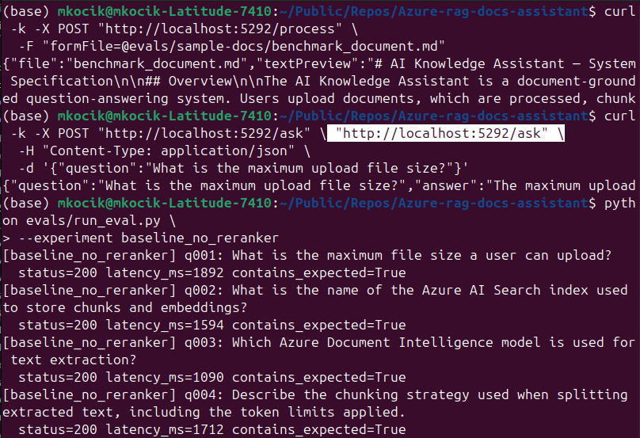
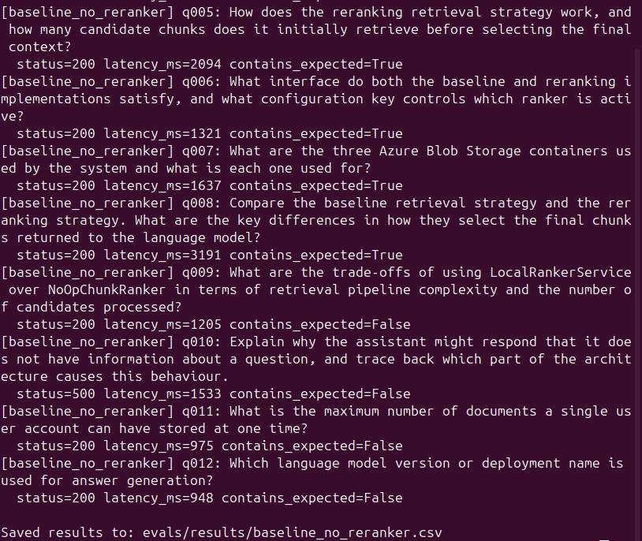
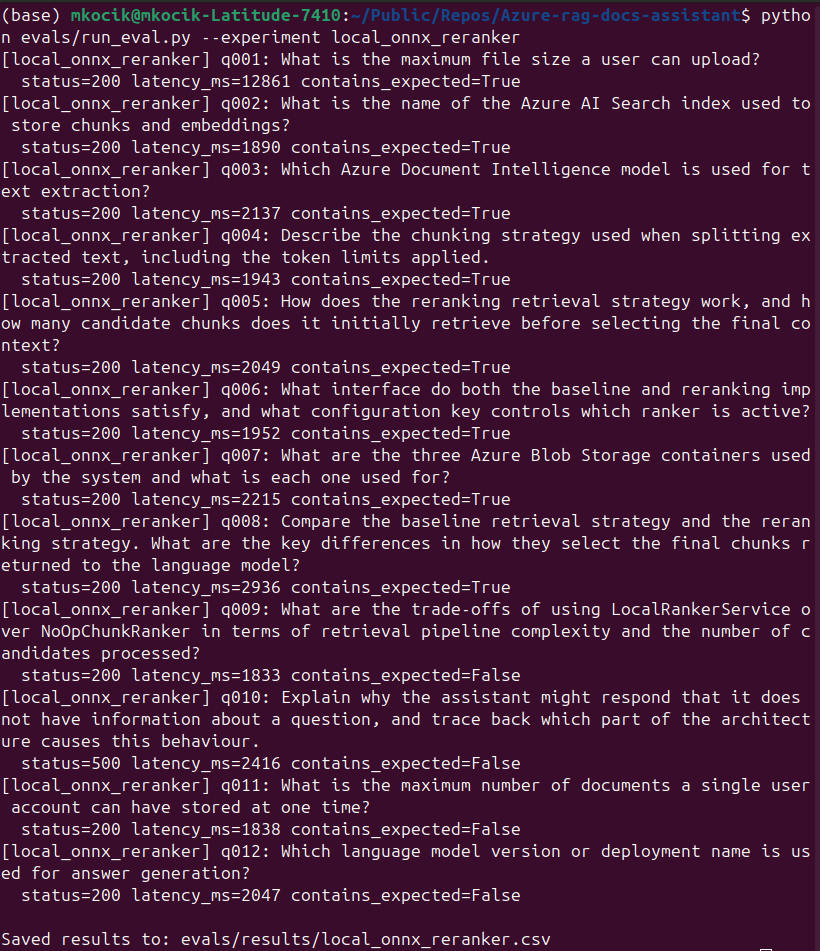

In the first synthetic benchmark, both baseline vector retrieval and local ONNX reranking achieved the same simple keyword-based correctness score: 8/12. The reranker increased average latency, mostly due to local ONNX inference overhead and one high-latency outlier. 

> [!NOTE]
> This suggests that on a short synthetic document, reranking does not provide measurable quality gains yet. More difficult multi-document eval data is  needed to demonstrate reranking benefits.

## No reranker experiment



## Reranker experiment


## How to run
For no reranker option:
```bash
python evals/run_eval.py --experiment baseline_no_reranker
```

For reranker option:
```bash
python evals/run_eval.py --experiment local_onnx_reranker
```

> [!IMPORTANT]
> Before this step run 'dotnet run' in another console

Results in evals/results/... .csv